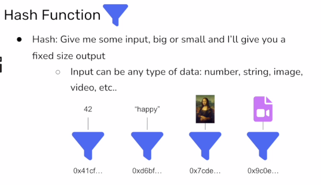
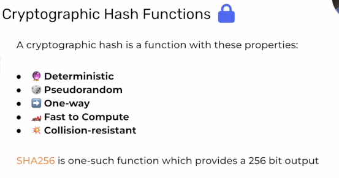

# Cryptography 
[Link](https://university.alchemy.com/course/ethereum/md/630e3d0a456dc80004ad6b6d)

1. Hash Functions  
    
2. Properties of Hash Functions 

   *  Deterministic - One specific input always maps to the same specific output
   *  Pseudorandom - It is not possible to guess the output based on the output of similar inputs
   *  One-way - If someone gives you a new output, you could not determine an input without guessing
   *  Fast to Compute - It must be a quick calculation for a computer
   *  Collision-resistant - The chance of a collision should be infinitesimally small

## Resources
1. [Online SHA256 Tool](https://emn178.github.io/online-tools/sha256)
2. [Boot.dev SHA 256 article](https://blog.boot.dev/cryptography/how-sha-2-works-step-by-step-sha-256/)
3. [Go Implementation article](https://t-i-show.medium.com/go-implement-sha256-encryption-and-hashing-in-go-77ab85c2560c)
4. [Nice video by RedBlockBlue] (https://www.youtube.com/watch?v=orIgy2MjqrA&ab_channel=RedBlockBlue)
5. [Very Comprehensive Exmplanation] (https://www.youtube.com/watch?v=9xs4eWOAG7Y&ab_channel=Xiuminseokie21)