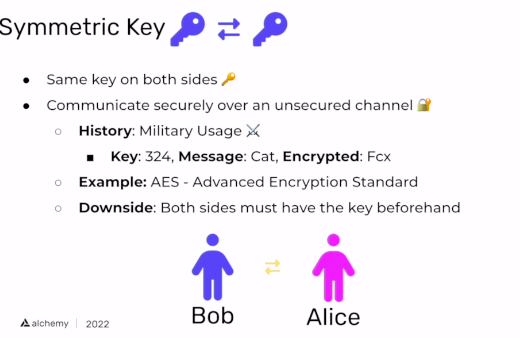
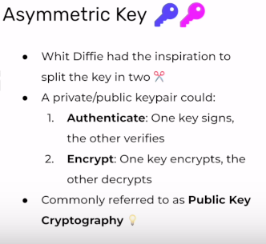

# Digital Signatures 
[Link](https://university.alchemy.com/course/ethereum/md/63122597968d750004f4f678)

1. Symmetric Key Cryptography  
    

2. Asymmetric Key Cryptography  

[Assignment](Exercises/2.PublicKeyCryptography)
## Todos 
* Learn topics from slides (AES, RSA and ECDSA) and Public Key Crypto in detail

## Resources 
* https://university.alchemy.com/course/ethereum/md/614b9f3c7e426a001019be59
* [SHA 256 vs Keccak 256](https://www.geeksforgeeks.org/difference-between-sha-256-and-keccak-256/)